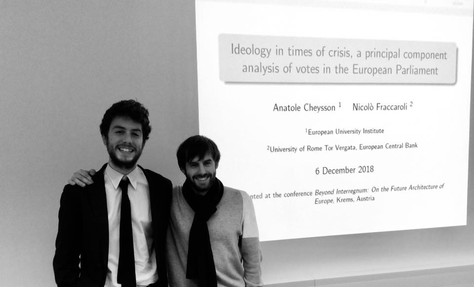

# About EP Votes

EP Votes is a data project started by Anatole Cheysson and Nicolò Fraccaroli. Anatole and Nicolò met in Frankfurt in 2017 and have collected data on how Members of the European Parliament vote ever since.

Nicolò (left) and Anatole (right) in Krems, Austria, at the first presentation of their project.

EP Votes is an academic project aimed at providing insights into European Parliament voting patterns.

_This website is built using Jekyll and hosted on GitHub Pages._
